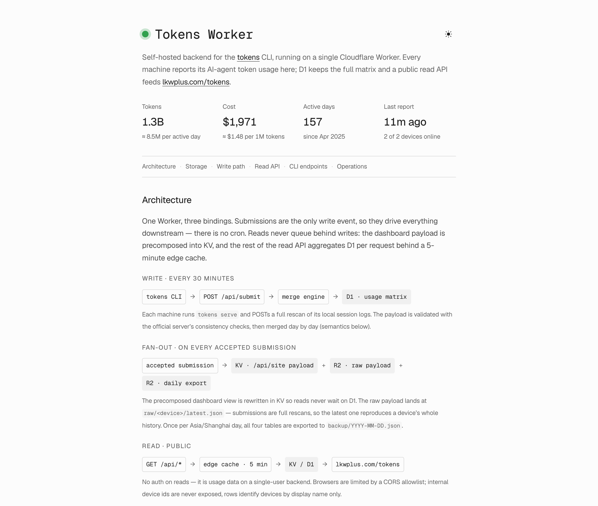

# tokens-worker

Self-hosted backend for the [`tokens`](https://github.com/missuo/tokens) CLI, running on Cloudflare Workers + D1 (+ KV for the precomposed site payload, R2 for backups) and served at [tokens.lkwplus.com](https://tokens.lkwplus.com).

<picture>
  <source media="(prefers-color-scheme: dark)" srcset="docs/homepage-dark.png">
  
</picture>

Each machine runs `tokens serve` with `TOKENS_API_URL=https://tokens.lkwplus.com`; the CLI POSTs a full rescan of its local session logs every 30 minutes. This Worker implements the official server's submission contract and merge semantics, stores the full usage matrix in D1, and serves one precomposed read endpoint for the personal site.

Every accepted submission also (a) rewrites the precomposed `/api/site` payload in KV, (b) archives the raw payload to R2 (`raw/<deviceId>/latest.json` — submissions are full rescans, so the latest one reproduces the device's whole history), and (c) once per Asia/Shanghai day exports the usage tables to R2 (`backup/YYYY-MM-DD.json`), a long-term backup beyond D1's 30-day Time Travel. One other write reaches the same payload — the subscription quota snapshot, reported by a collector on one host (see [Quota collection](#quota-collection)). Both are events, so no cron is needed.

Everything on that fan-out is bounded in size, deliberately: the raw archive uses one fixed key per device, the daily exports are pruned past 180 days, and the submission audit log is a rolling 30-day window trimmed by the same batch that appends to it. Devices rescan every 30 minutes whether or not anything changed — over 80% of submissions write no usage rows at all — so anything that accumulated per submission would grow forever on cadence alone, and anything copied into a fresh daily object would grow with the *square* of time.

## Homepage

The root URL serves a static homepage (`public/index.html`, via [Workers Static Assets](https://developers.cloudflare.com/workers/static-assets/)) documenting the architecture and the API, with live totals and collector status pulled from `/api/site` and a light/dark toggle. Assets are matched before the Worker runs, so `/api/*` routing is untouched.

One self-contained HTML file — no build step, no dependencies. The design tokens mirror lkwplus.com so the page reads as part of the site; fonts are vendored copies of [Geist and Geist Mono](https://vercel.com/font) (SIL OFL 1.1). When endpoints or semantics change, update this page together with the README.

## Storage model

Usage is stored at maximum granularity — one row per **(device, date, client, model, provider)** with the full token breakdown (`input`, `output`, `cache_read`, `cache_write`, `reasoning`), `messages`, `cost`, and the parser revision that produced it. `/api/site` is an aggregation of this matrix, and the matrix keeps every raw id the CLIs reported, so any view the CLI can produce locally is still derivable here — through D1 rather than through an HTTP endpoint.

Sidecar tables: `daily_activity` (per-day `activeTimeMs`), `devices` (name, CLI version, time metrics, MCP server list), `submissions` (audit log of accepted submissions, kept for 30 days — it answers "did the last report land, and on what cadence", a question only about recent history).

Migrations are **append-only**: D1 tracks them by filename, and `0003` drops and recreates the tables, so renaming or collapsing the applied files would re-run a destructive migration against production.

## Merge semantics (write path)

Ported from the official server (`web/src/app/api/submit/route.ts` + `lib/db/helpers.ts`; paths as of the upstream v27 rebuild, formerly under `packages/frontend/`):

- **Per-day, per-client replace.** A submission replaces each (device, day, client) bucket it mentions; clients or days it does not mention are left untouched.
- **Regression guard.** Within the same parser revision, a resubmit that would *reduce* a client's tokens for a day is ignored with a warning (local log cleanup can never erase stored history). A client that disappears from a day while still listed in `summary.clients` is preserved with a warning.
- **Parser revision floors.** A client whose `provenance.schemaVersion` is older than any revision already stored for that client on that device is rejected wholesale (stale-parser protection).
- **Authoritative coverage.** `clientManifest` entries with `coverage: {mode: "full", start, end}` (sent by `tokens submit --replace`) authoritatively replace that client within the window — including tombstoning days the new scan no longer contains.
- **Normalization.** The `kilocode`→`kilo` alias and empty `modelId`→`"unknown"`, as in the official server. Pre-v2 payload shapes (`sources`/`source` keys, per-day `timestampMs`) are intentionally not supported — only current CLIs report here.
- **Validation.** The official mathematical-consistency checks run on every submission (day totals vs client sums, summary vs calculated totals, future dates, duplicate dates, cost-without-tokens with the Cursor `premium-tool-call` carve-out). Failures return `400 {error: "Validation failed", details}`. Deviation: unknown client ids are accepted with a warning instead of rejected, so a newer CLI keeps working without a Worker redeploy.
- **Float-drift tolerance.** The CLI recomputes costs on every scan, so consecutive scans differ by ~1e-14; sub-1e-9 relative cost drift counts as "unchanged" and does not rewrite the day.
- **Atomic set-based writes.** Changed rows travel as JSON parameters expanded server-side with `json_each`, so a submission is a handful of statements (delete + insert + activity upsert + device + audit row) in **one D1 batch** — one transaction, no partial-write states — regardless of history size. This keeps even a full-history first upload far below D1's per-invocation query limits (50 on the Free plan, counted per statement across all batches).

## API

### CLI-facing endpoints

Every CLI endpoint requires `Authorization: Bearer $TOKENS_API_TOKEN`; the read endpoint below is public.

| Endpoint | Used by | Description |
|---|---|---|
| `POST /api/submit` | `tokens submit` / `serve` / `autosubmit` | Full submission payload; responds `{success, submissionId, username, metrics, mode, warnings?}` |
| `POST /api/quota` | `scripts/report-quota.sh` | Subscription rate-limit snapshot — see [Quota collection](#quota-collection); responds `{success, capturedAt, provider}` |
| `DELETE /api/settings/submitted-data` | `tokens delete-submitted-data` | Wipes all stored data across all three stores — D1 tables, every R2 object (raw archives and daily backups reproduce submitted data, so they go too), and the KV site payload, recomposed synchronously so the dashboard is clean before the CLI hears "success"; responds `{deleted, deletedSubmissions}` |
| `GET /api/auth/token` | `tokens login --token tt_...` | Token validation; responds `{user: {username}}` |

Not implemented: the browser GitHub-OAuth device flow (`POST /api/auth/device[/poll]`); log in with `tokens login --token` instead.

### Public read endpoints (no auth; open CORS)

There is one, and that is deliberate. `/api/site` is the view lkwplus.com/tokens consumes; this backend has no second consumer. A filterable aggregation API used to sit beside it — `/api/stats`, `/api/timeseries`, `/api/breakdown`, `/api/graph`, `/api/meta`, `/api/devices`, `/api/submissions`, 677 lines of query parsing and SQL — and nothing ever called it: the CLI computes those views locally from its own logs, and the dashboard reads the precomposed payload. It was a public surface maintained for hypothetical callers, so it went.

Nothing about the stored data changed. The matrix is still one row per (device, date, client, model, provider) at full fidelity, and it is still reachable — `wrangler d1 execute tokens-usage --remote --command "..."` for ad-hoc questions, the R2 raw archives for each device's last full rescan, the daily R2 exports for point-in-time copies. What is gone is the HTTP surface, not the data or the ability to ask it anything.

`/api/site` is freshness-critical, so it never guesses with TTLs: `Cache-Control: no-cache` plus a strong `ETag` make browsers revalidate every load — a ~0-byte `304` while the data is unchanged, the new payload the moment a submission rewrote it (worst case ~30 s, KV's per-PoP cache).

Internal device ids never leave the Worker; rows identify devices by display name. Model and provider ids are canonicalized **before** aggregation (per-effort variants like `claude-fable-5-thinking-max` merged into `claude-fable-5`; subscription-auth provider spellings like pi's `openai-codex` merged into `openai`), which is what makes the per-day model slices agree with the `byModel` breakdown. Canonical providers mean **model vendors**: rows whose provider id is not a vendor claim are re-attributed by model name with the same inference rules the CLI's cursor parser uses (a Claude model via Zed counts as `anthropic`, DeepSeek via OpenCode Go as `deepseek`, GLM via OpenCode zen as `zai`). Two kinds qualify — the serving gateway a client reported as its provider (Zed's `zed.dev`, OpenCode's `opencode` / `opencode-go`), and *any* id from a client whose models the user configures by hand (Hermes Agent, whose `openai` names an OpenAI-compatible base URL and has carried DeepSeek). Models the rules can't place (`composer-*`, `big-pickle`, ...) stay under the reported id, and a vendor id that really is a claim is never second-guessed — rules + alias tables in `src/models.ts`. D1 keeps the raw spellings either way, so none of this is lossy. "Active days" count any activity, messages included (early-2025 Cursor logs carry message counts without token usage).

Every breakdown row carries the full metric set: `input`, `output`, `cacheRead`, `cacheWrite`, `reasoning`, `tokens` (sum of the five), `messages`, `cost`. A known path with the wrong method answers `405` with `Allow`; an unhandled failure answers `500` with a JSON body and full CORS, so a cross-origin reader sees the reason rather than a CORS error.

| Endpoint | Description |
|---|---|
| `GET /api/site` | Precomposed dashboard view, one request for the whole page: the reported `quota` snapshot (`null` until a collector has spoken), per-range (`day`/`week`/`month`/`quarter`/`all`, where `day` is today in Asia/Shanghai — it backs the dashboard's Today section and is the only place the full metric set is split per model for a single day) totals + breakdowns (every row carries its usage span — `days`, `firstDate`, `lastDate`; model rows name the `providers` that served them, and **client and provider rows carry `models`** — the client × model and provider × model cells, the slices the marginals cannot reconstruct), the full daily series sliced **by provider, by client and by model** (canonical ids, `{tokens, cost}` each) with per-day `active` time, and the device inventory incl. CLI version, sessions, active-time metrics and MCP servers. Costs are rounded to microdollars. The whole payload is a view **as of today**: submissions may carry dates up to two days ahead (clock skew, timezones east of Asia/Shanghai), and those rows stay in D1 until their own day arrives rather than landing in a window that ends today. No filters; served from KV. The body carries `schemaVersion` — see [Cross-repo contract](#cross-repo-contract) |
| `GET /api/health` | Liveness check (`/` serves the static homepage) |

### Cross-repo contract

`/api/site` is versioned: the body carries `schemaVersion` (`SITE_VERSION` in `src/site.ts`), which the homepage (`../homepage/src/lib/client/tokens.ts`, `SITE_SCHEMA_VERSION`) validates strictly and keys its cache by, so a stale cache or a mid-deploy mismatch falls back to a refetch instead of a renderer crash. Bump both together on any shape change and refresh the homepage's committed fixture (`src/lib/client/tokens.site-fixture.json`). The producer shape is pinned by `test/site.spec.ts`, the consumer by the homepage's `tokens.test.ts`.

The two repos deploy independently, so a bump has no atomic moment — whichever ships first talks to the other side's previous version for a minute or two, and visitors without a session cache see the fallback for that window. **Ship this Worker first**: the fixture has to be captured from a live endpoint already serving the new schema, so the producer leads and the page falls back until the homepage deploy lands (schemas 9 and 10 both went out this way). The window can be closed by temporarily letting the consumer's `isSite` accept the previous version alongside the new one and shipping the homepage first, but that only works for shapes the older reader survives, and it costs an extra round trip through both repos; at rest the consumer accepts exactly one version, which is what keeps the two sides honest.

## Quota collection

The dashboard also answers a question no session log can: how much of the
Codex subscription's weekly window is already spent. That number lives at
the vendor, and reaching it needs an OAuth credential — so the credential
is the thing that decides the architecture.

It never leaves the machine that holds it. **OracleARM** — the host that
already runs `tokens serve` — runs `scripts/report-quota.sh` on a 30-minute
systemd user timer; the script shells out to `tokens codex status --json`
(which reads the local `~/.codex/auth.json`, refreshes the OAuth token when
it has expired, and calls ChatGPT's usage API) and POSTs the result to
`/api/quota`. The Worker stores no vendor secret, runs no scheduled job,
and sees percentages and timestamps and nothing else.

That output belongs to a third-party CLI, so **nothing is passed through**.
`src/quota.ts` narrows it by hand into the shape `/api/site` publishes —
which is where the account's email address is dropped, since that endpoint
is public and unauthenticated, and where an upstream field rename becomes a
400 instead of a silent homepage change. The snapshot is a full overwrite,
so a plan change cannot leave a stale window behind.

It is stored in **KV, not D1**: one key, rewritten in place, constant in
size forever. A percentage a collector can re-fetch in a second is not
history, and the fan-out's rule is that nothing accumulates on cadence. For
the same reason it is not copied into the daily R2 export — but it *is*
deleted by `DELETE /api/settings/submitted-data`, because it names the
account's plan.

Quota is account-wide, so exactly one host reports it; a second would add a
race and no information. Which also means the payload can go stale silently
if that host sleeps — `capturedAt` (the *server's* clock, never the
collector's) is the reader's only defence, so it always ships, and the
dashboard ages the card by it rather than presenting an undated number as
current. Reset times are absolute, so a window that has since rolled over
reads as reset rather than as a stale percentage.

Installing it on a fresh host, as the `agent` user:

```sh
install -Dm755 scripts/report-quota.sh ~/.local/bin/report-quota.sh
install -Dm644 scripts/tokens-quota.{service,timer} -t ~/.config/systemd/user/
systemctl --user daemon-reload && systemctl --user enable --now tokens-quota.timer
systemctl --user start tokens-quota.service   # report once, now
```

The bearer token is read from the CLI's own `~/.config/tokens/credentials.json`
rather than copied into the unit file, so there is one thing to rotate. The
timer needs `loginctl enable-linger` for the user, which `tokens serve`
already required.

## Security & privacy

- **The only secret is `TOKENS_API_TOKEN`** (the write-path bearer token). It lives as a Worker secret in Cloudflare and in the gitignored `.dev.vars` locally — never committed. The auth check hashes both sides and compares with the runtime's timing-safe primitive.
- **`wrangler.jsonc` carries resource identifiers, not credentials** — the D1 `database_id` and KV namespace `id` only name the bindings; access requires a Cloudflare API token that is not in the repo.
- **Reads are public by design** — aggregate usage numbers for a personal dashboard. Internal device ids never leave the Worker at all: public rows identify devices by display name (an integration test pins this), raw payloads / backups stay in the private R2 bucket, and the one endpoint that ever returned ids (`GET /api/me/stats`, whose consumer the CLI dropped in v27) has been removed. The quota snapshot is narrowed the same way: the vendor reports the account's email address with it, and it is dropped at the door — `test/quota.spec.ts` asserts the string never appears in the public body.
- **No vendor credential lives here.** The quota number needs OAuth against ChatGPT; that happens on the collecting host, which reports the finished percentages. There is nothing to steal from the Worker that would grant access to the subscription.
- **CORS is a static wildcard, never Origin-derived.** Reads are cacheable, and an Origin-dependent header on a cacheable response poisons caches (`src/http.ts` documents the incident).

## Setup & deploy

One-time provisioning:

```sh
npm install
npx wrangler d1 create tokens-usage        # put the database_id into wrangler.jsonc
npx wrangler d1 migrations apply tokens-usage --remote
npx wrangler kv namespace create SITE_CACHE  # put the id into wrangler.jsonc
npx wrangler r2 bucket create tokens-archive
npx wrangler secret put TOKENS_API_TOKEN   # same token as in ~/.config/tokens/credentials.json
```

**Deploys are Git-driven and test-gated.** The Worker is connected to this repo via [Workers Builds](https://developers.cloudflare.com/workers/ci-cd/builds/): every push to `main` builds and deploys to production (build command `npm run check`, so a red run aborts the deploy). Other branches upload a preview version without touching production, and GitHub Actions (`.github/workflows/ci.yml`) runs the same gate on every push and PR. There is deliberately no `deploy` script — a manual `npx wrangler deploy` puts code live that Git doesn't know about, and the next push overwrites it.

The custom domain route (`tokens.lkwplus.com`) is declared in `wrangler.jsonc` and provisioned on deploy; `workers_dev` is disabled. `TOKENS_USERNAME` (a plain var there) is the username echoed by `/api/auth/token` and submit responses. The Worker name in the Cloudflare dashboard must keep matching `name` in `wrangler.jsonc` (`tokens-usage`) or builds fail.

## Local development

```sh
npx wrangler d1 migrations apply tokens-usage --local
echo 'TOKENS_API_TOKEN=...' > .dev.vars   # gitignored
npm run dev                               # wrangler dev on :8787, local D1
npm run check                             # the full gate
TOKENS_API_URL=http://localhost:8787 tokens submit   # end-to-end with a real CLI
```

`npm run check` = `wrangler types` + `tsc` over src + `tsc` over tests (the two passes are separate on purpose: src must typecheck without the tests' type augmentations) + `vitest run`.

Tests run inside workerd via [`@cloudflare/vitest-pool-workers`](https://developers.cloudflare.com/workers/testing/vitest-integration/) against real (miniflare-backed) D1/KV/R2 bindings with migrations applied, so integration tests exercise the production code paths with no mocks:

- **Unit** — merge engine (`test/merge.spec.ts`), payload validation (`test/payload.spec.ts`), model/provider canonicalization (`test/models.spec.ts`).
- **Integration** (`test/worker.spec.ts`) — auth boundaries, the submit → merge → KV/R2 fan-out, idempotent resubmits, retention on both bounded stores, full-wipe delete semantics, and the error path (a thrown handler must answer JSON + CORS, not a bare 500).
- **Producer contract** (`test/site.spec.ts`) — the `/api/site` shape, mirrored consumer-side by the homepage's decoder and fixture.

## Project layout

```
src/index.ts             Router (one "METHOD /path" -> handler table)
src/http.ts              Env, static CORS headers, timing-safe bearer auth, TZ
src/metrics.ts           The metric set: TS shape, SQL projection, fold helpers
src/payload.ts           Submission types, normalization, official validation
src/merge.ts             Per-day per-client merge engine (regression guard,
                         revision floors, authoritative coverage)
src/submit.ts            Write path (atomic set-based D1 writes) + CLI-facing
                         endpoints; drives the KV site refresh and R2 archives
src/models.ts            Canonical model/provider ids (suffix rules + alias
                         tables; extend ALIASES for new spellings)
src/site.ts              /api/site — precomposed, schema-versioned dashboard
                         view (no-cache + ETag over KV over one D1 batch)
src/backup.ts            Daily usage-table export to R2 (pruned past 180
                         days) + full-wipe helper
test/                    Vitest suite (workerd runtime, real bindings)
public/                  Static homepage, served at / by Workers Static Assets
docs/                    README screenshots (not deployed)
migrations/              D1 schema, append-only (0003 rebuilt it, 0004
                         trimmed the audit log)
vitest.config.mts        vitest-pool-workers config (migrations, test token)
wrangler.jsonc           Worker config (domain, D1/KV/R2 bindings, assets)
```
